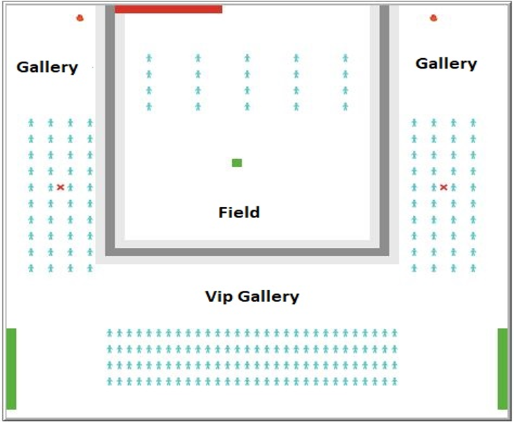
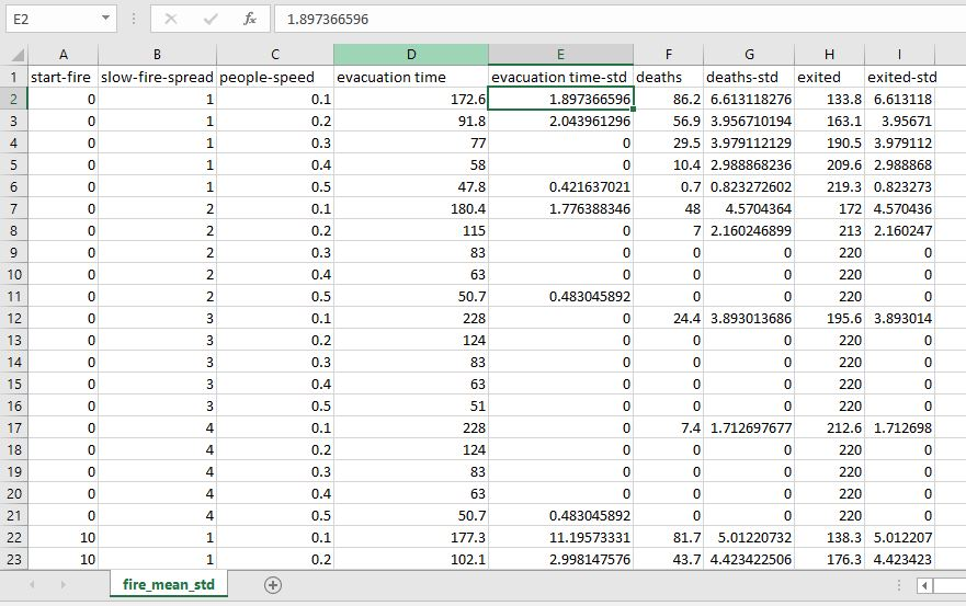
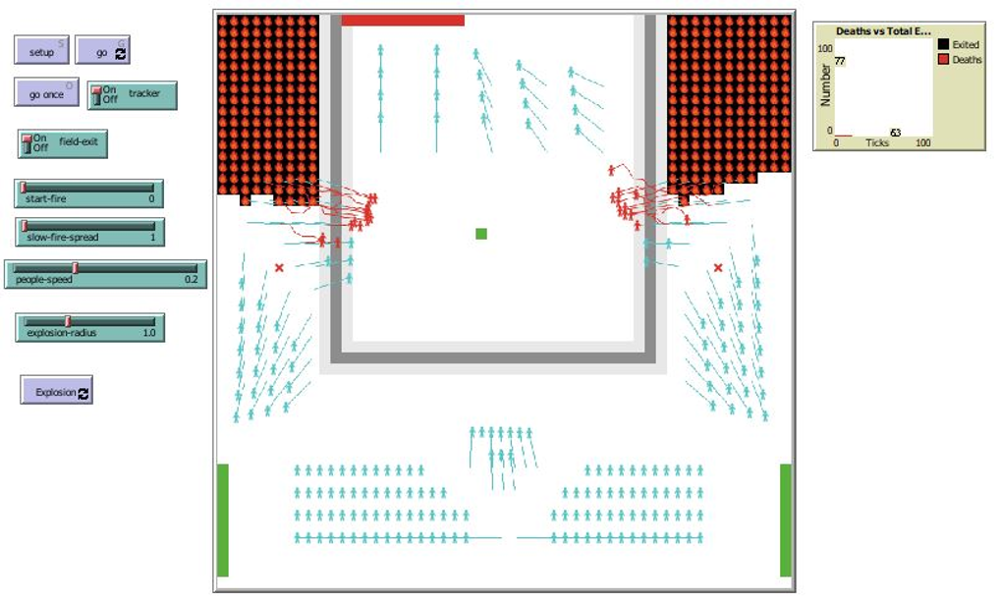

# 🏟️ Crowd Evacuation in Stadium

A **NetLogo-based simulation** for modeling crowd evacuation scenarios during emergency events in a stadium setting. This project explores the behavior of individuals in panic situations like fire outbreaks or explosions using agent-based modeling.

Developed as part of **CSE 562: Project Presentation**  
**Group Members:**  
- Arifuzzaman Arman 
- Fayezah Anjum 

---

## 📌 Project Overview

This project simulates emergency evacuation scenarios to study:
- Crowd behavior under panic
- Impact of fire spread and explosion on evacuation
- How speed and timing influence fatalities and evacuation success

We used **NetLogo** for the simulation and **Python (Pandas)** for analyzing the results of 800 experiments with varying parameters.

---

## 🔥 Scenarios Simulated

1. **Sudden Outbreak of Fire** in the stadium gallery  
2. **Explosion or Bomb Blast**

These were designed to mimic real-world emergency situations and test evacuation efficiency.

---

## 🌍 World Design and Assumptions

- Fire starts from a fixed location  
- Exit locations and sizes are constant  
- People move at a constant speed  
- Exits do not change dynamically  

  
**Fig: 1** *NetLogo world layout with crowd and exits*

---

## ⚙️ State Variables

1. **People movement speed**  
2. **Fire spread speed**  
3. **Start time of fire (ticks)**

### 📊 Performance Measures
- Number of deaths  
- Number of evacuees  
- Total evacuation time  

---

## 🧪 Experiment Setup

- 800 simulations with 80 combinations of state variables  
- 10 repetitions per setting using NetLogo’s **BehaviorSpace**  
- Post-analysis in Python using **Pandas** for calculating **mean** and **standard deviation**

  
**Fig: 2** *Sample result table from simulation*

---

## 🔍 Key Observations

| Variable Change         | Resulting Effect |
|-------------------------|------------------|
| ⬆️ People speed         | ⬇️ Deaths, ⬆️ Evacuees, ⬇️ Evacuation time |
| ⬇️ Fire spread speed    | ⬇️ Deaths, ⬆️ Evacuees, ⬆️ Evacuation time (slightly) |
| ⬆️ Fire start delay     | ⬇️ Deaths, ⬆️ Evacuees, ⬆️ Evacuation time (slightly) |

---

## 📷 Simulation Snapshots

  
**Fig: 3** *People evacuating as fire spreads*

---

## 📚 References

- Large Event Halls Evacuation Using an Agent-Based Modeling Approach [DOI](https://doi.org/10.1109/ACCESS.2022.3172285)  
- Simulating Metro Station Evacuation using Agent-Based Exit Models [DOI](https://doi.org/10.1016/j.cstp.2021.06.011)  
- Evacuation Time Model for Stadium Risk Analysis [DOI](https://doi.org/10.1205/psep06026)  
- Crowd Evacuation in Hajj Stoning Area [DOI](https://doi.org/10.3390/su14042278)

---

## 🛠️ Tools Used

- **NetLogo** (Agent-Based Modeling)  
- **Python (Pandas)** (Statistical Analysis)  
- **PowerPoint** (Visualization and Presentation)

---

## ✅ How to Run

1. Open `CrowdEvacuation.nlogo` in NetLogo
2. Use the BehaviorSpace to run simulations
3. Analyze results using the provided Python script
